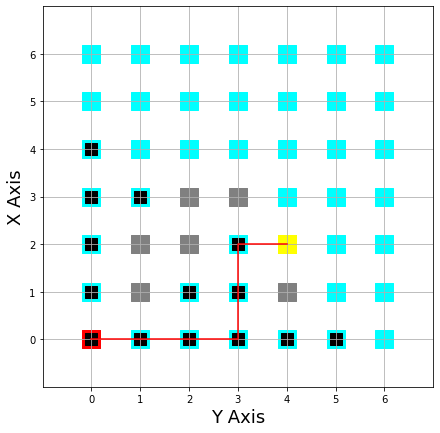

This repo contains the code for a BFS using a graph approach on a 2D matrix
simulation a robot finding its path in a maze
the start position is represented by a red square
the stop position by yellow square

